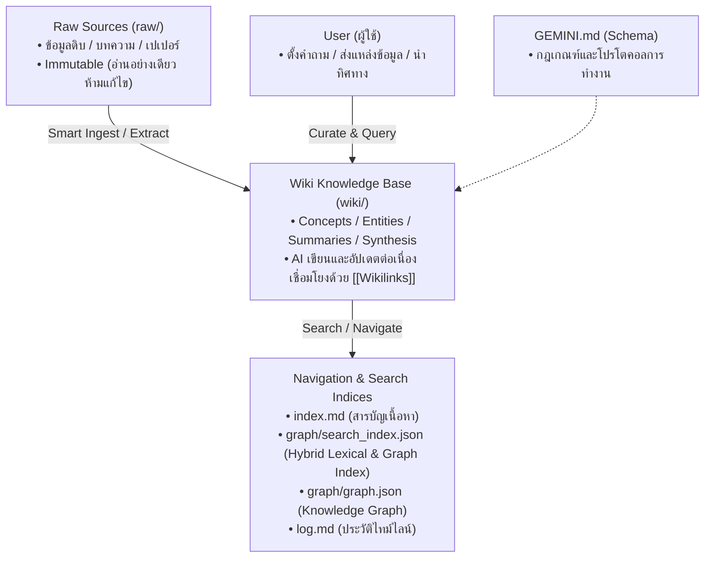

# 🧠 GEMINI.md — Wiki Agent Schema & Operating Protocol

เอกสารนี้คือ **Schema & Operating Manual** หลักสำหรับ AI Agent (Antigravity / Gemini / Claude / ChatGPT) ในการบริหารจัดการคลังความรู้ส่วนบุคคล (**มหาคลังความรู้ / Second Brain**) ตามปรัชญา **LLM Wiki Pattern (Production Hardened)**

---

## 🏛️ 1. สถาปัตยกรรม 3 ชั้น (3-Tier Architecture)



1. **Raw Sources (`raw/`)**: แหล่งข้อมูลดิบ (บทความ, บันทึก, ไฟล์สรุป, transcripts, เปเปอร์) **ห้ามแก้ไขข้อมูลดิบ** เป็น Single Source of Truth
2. **The Wiki (`wiki/`)**: คลังความรู้ที่ผ่านการสกัด เชื่อมโยง และเรียบเรียงโดย AI แบ่งเป็น:
   - `wiki/concepts/` : มโนทัศน์, ทฤษฎี, เฟรมเวิร์ก, องค์ความรู้เชิงลึก (หลอมรวมแบบ Evergreen พร้อม Claim Provenance)
   - `wiki/entities/` : บุคคล, เครื่องมือ, ซอฟต์แวร์, องค์กร, หนังสือ
   - `wiki/summaries/` : สรุปใจความสำคัญของแหล่งข้อมูลแต่ละชิ้น
   - `wiki/synthesis/` : บทสังเคราะห์เปรียบเทียบ, คำตอบเชิงลึกจากการ Query ในแชท
3. **The Schema & Navigator**:
   - `GEMINI.md` : ข้อตกลงและกระบวนการทำงานของ Agent (ไฟล์นี้)
   - `index.md` : ดัชนีสารบัญรวมของทุกหน้าใน Wiki (Content Catalog)
   - `graph/search_index.json` : ดัชนีสืบค้น Hybrid Lexical, TF-IDF และ Graph Connectivity Index
   - `graph/graph.json` : แผนผังโครงข่ายความสัมพันธ์ (Knowledge Graph)
   - `log.md` : บันทึกประวัติกิจกรรมแบบ Append-only (Timeline History)

---

## ⚙️ 2. กฎเหล็กในการทำงานของ Wiki Agent (Core Rules)

1. **AI เป็นผู้ดูแลและเขียน Wiki (AI-Maintained)**: ผู้ใช้ทำหน้าที่คัดสรรแหล่งข้อมูล (Curator) และตั้งคำถามนำทาง AI ทำหน้าที่สกัด, เชื่อมโยง, จัดหมวดหมู่, และอัปเดตข้ามหน้า (Bookkeeping)
2. **Persistent & Compounding (Evergreen Refinement with Anti-Data-Loss)**: ความรู้ต้องสะสมและต่อยอด เมื่อมีข้อมูลใหม่ **ต้องทำการ Smart Merge หลอมรวมเนื้อหาเข้ากับหน้า Concept/Entity เดิม** โดยรักษาข้อเท็จจริงเดิมครบ 100% ห้ามสร้างไฟล์ทับหรือตัดแปะแยกเป็นท่อนๆ
3. **Cross-Referencing ด้วย `[[Wikilinks]]`**: ทุกหน้าที่สร้างหรือแก้ไข ต้องมี Internal Links ในรูปแบบ `[[Page-Name]]` เพื่อให้ Obsidian Graph View เชื่อมโยงเป็นโครงข่ายสมอง
4. **Structured Claim-Level Provenance**: ทุกไฟล์ Concept และ Entity ต้องมี metadata ระบุ `claims: [...]` พร้อม `section` และ `location` เพื่อให้สามารถตรวจสอบย้อนกลับได้ระดับประโยค
5. **ทุกการกระทำต้องบันทึกและตรวจสอบ**:
   - อัปเดต `index.md` เสมอเมื่อมีหน้าใหม่หรือสาระสำคัญเปลี่ยน
   - บันทึกการเปลี่ยนแปลงลงใน `log.md` ด้วยรูปแบบ `## [YYYY-MM-DD] action | Details` เสมอ
   - รัน Linter `scripts/lint_wiki.py` ตรวจสอบความถูกต้องของลิงก์และสารบัญเสมอ

---

## 🔄 3. มาตรฐานขั้นตอนการทำงาน (Operating Workflows)

### 📥 3.1 กระบวนการ Ingest & Smart Merging (นำเข้าและหลอมรวมข้อมูลใหม่)
เมื่อผู้ใช้ส่งข้อมูล/บทความใหม่ หรือสั่งให้อ่านไฟล์ใน `raw/`:
1. **Read & Extract**: อ่านข้อมูลดิบทั้งหมดอย่างละเอียด สกัดแก่นความรู้ ความคิดเห็น ข้อเท็จจริง และ Claim-Level Statements
2. **Create Summary**: สร้างหน้าสรุปใน `wiki/summaries/Summary-ชื่อเรื่อง.md`
3. **Smart Merge / Create Concepts & Entities**:
   - ตรวจสอบว่ามี Concept หรือ Entity เดิมอยู่แล้วหรือไม่
   - **ถ้ามีอยู่แล้ว (Smart Merge)**: อ่านเนื้อหาเดิม แล้วหลอมรวม (Synthesize) มุมมองใหม่เข้าไป ปรับปรุง Frontmatter `updated: YYYY-MM-DD`, อัปเดต `claims: [...]`, เพิ่มแหล่งอ้างอิง และขจัดข้อขัดแย้งให้เป็นเนื้อความเดียวกัน
   - **ถ้ายังไม่มี**: สร้างหน้าใหม่ใน `wiki/concepts/` หรือ `wiki/entities/`
4. **Cross-Linking**: ใส่ `[[Wikilinks]]` เชื่อมโยงข้ามหน้าอย่างหนาแน่น
5. **Update Indices & Graph**: อัปเดต `index.md` ครบ 3 หมวดหมู่ และเรียก `run_graphify.py` เพื่อสร้าง `graph.json` และ `search_index.json`
6. **Log Entry**: บันทึกกิจกรรมลง `log.md` ในรูปแบบ `## [YYYY-MM-DD] ingest | ชื่อแหล่งข้อมูล`
7. **Report to User**: รายงานสรุปหน้าที่สร้าง/หลอมรวม และเสนอประเด็นที่น่าสนใจ

---

### 🔍 3.2 กระบวนการ Query & Synthesis (ตอบคำถามและสังเคราะห์เชิงลึก)
เมื่อผู้ใช้ถามคำถามเชิงลึก หรือต้องการเปรียบเทียบ/วิเคราะห์:
1. **Hybrid Search & Retrieval**: ตรวจสอบ `index.md` หรือใช้ `scripts/search_wiki.py` / `graph/search_index.json` เพื่อดึงโน้ตที่ตรงตามคำค้นหาและโครงข่ายความสัมพันธ์สูงสุด
2. **Synthesize with Citations**: สังเคราะห์คำตอบจากหลายๆ หน้า อ้างอิงแหล่งที่มาด้วย `[[Wikilinks]]` และ Claim IDs
3. **File Back into Wiki**: หากคำตอบเป็นการวิเคราะห์ที่มีคุณค่า ให้บันทึกลงใน `wiki/synthesis/Synthesis-ชื่อเรื่อง.md` พร้อม Frontmatter ครบถ้วน เพื่อไม่ให้ความรู้สูญหายไปกับประวัติแชท
4. **Update Catalog & Log**: เพิ่มลิงก์ลงใน `index.md` (หมวด Synthesis) และบันทึกลง `log.md`

---

### 🧹 3.3 กระบวนการ Lint & Verification (ตรวจเช็กสุขภาพคลังความรู้)
ทำเป็นระยะ หรือเมื่อผู้ใช้สั่ง "lint" / "ตรวจสอบระบบ":
1. ตรวจสอบ **Broken Links** (ลิงก์ที่ยังไม่มีหน้าจริง)
2. ตรวจสอบ **Orphan Pages** (หน้าที่ไม่มีลิงก์ชี้มา)
3. ตรวจสอบ **YAML Frontmatter Integrity & Claim Provenance**
4. ตรวจสอบ **Index Synchronization** ระหว่าง `index.md` กับไฟล์จริง
5. สรุปรายงานและสั่ง Auto-repair หากมีโน้ตตกหล่น

---

## 📝 4. เทมเพลตมาตรฐานสำหรับ Markdown Files

### Frontmatter สำหรับ Concept / Entity (พร้อม Structured Claims & Location)
```markdown
---
type: concept # หรือ entity, summary, synthesis
created: YYYY-MM-DD
updated: YYYY-MM-DD
tags:
  - knowledge-management
  - ai
aliases:
  - คำเรียกอื่น
sources:
  - "[[Summary-SourceName]]"
claims:
  - id: C-001
    statement: "นิยามและแก่นสำคัญของมโนทัศน์นี้"
    source: "[[Summary-SourceName]]"
    section: "แก่นความคิด"
    location: "ย่อหน้า 1"
    status: verified
provenance:
  source_doc: "[[Summary-SourceName]]"
  verified_date: YYYY-MM-DD
  compiler: "Universal LLM Wiki Engine"
---
```

### โครงสร้างหน้า Concept / Entity (Evergreen Structure)
```markdown
# ชื่อหัวข้อ / ชื่อ Concept

## 📌 บทนิยามและแก่นความคิด (Core Idea)
สรุปความเข้าใจรวบยอด 1-2 ย่อหน้า

## 🧩 รายละเอียดและกลไกสำคัญ (Key Mechanics / Details)
เนื้อหาหลัก อธิบายพร้อมลิงก์ไปยัง [[Concept-อื่น]] หรือ [[Entity-อื่น]]

## 🔄 ความสัมพันธ์และการเปรียบเทียบ (Connections & Nuances)
- เปรียบเทียบกับ [[แนวคิดใกล้เคียง]]
- จุดต่าง/ข้อสังเกต

## 📚 แหล่งอ้างอิงและประวัติ (Provenance)
- [[Summary-ชื่อหน้าสรุปข้อมูลดิบ]] (Verified: YYYY-MM-DD)
```

---

## 🎯 5. ปฏิญญาของ Agent
> *"ฉันจะไม่ปล่อยให้ความรู้สูญหายไปกับประวัติการแชต ทุกความคิด ทุกบทความ และทุกคำถามที่มีคุณค่า จะถูกถักทอเข้าเป็นโครงข่ายความรู้ที่พัฒนาตัวเองอย่างต่อเนื่องในมหาคลังความรู้แห่งนี้"*
