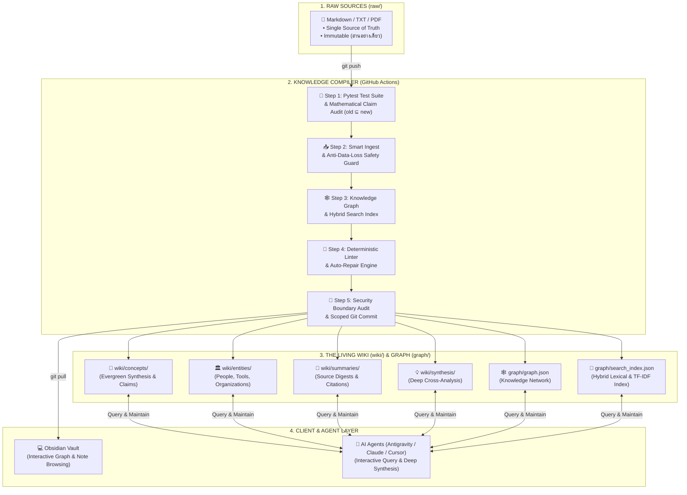

# 🧠 Universal LLM Wiki Engine

> **The Open-Source Knowledge Compilation Engine: Obsidian-First + Git-Native + Multi-Provider AI + Knowledge Graph + Auditable Provenance**

ระบบคลังความรู้และสมองที่สองอัตโนมัติระดับองค์กร (Production-Grade Knowledge Compilation Pipeline) ที่เชื่อมต่อระหว่าง **Obsidian Vault**, **GitHub Actions (Hardened CI/CD)**, และ **AI Providers (Google Gemini, Anthropic Claude, OpenAI ChatGPT)**

---

## 🏛️ สถาปัตยกรรมระบบและการไหลของข้อมูล (System Architecture & Data Flow)



---

## 🌟 ฟีเจอร์เด่นระดับ Production (Hardened Features)

* 🧠 **Smart Merging with Anti-Data-Loss Guard**: เมื่อมีข้อมูลใหม่ ระบบจะหลอมรวมเข้ากับโน้ตเดิมอย่างกลมกลืน พร้อม Safety Guard รับประกันเนื้อหาเดิมไม่สูญหาย 100%
* 📜 **Structured Claim-Level Provenance**: เก็บข้อเท็จจริงแยกเป็นรายการ `claims: [{ id: "C-001", statement: "...", source: "...", section: "...", location: "...", status: "verified" }]` ตรวจสอบย้อนกลับได้ถึงระดับย่อหน้า
* 🔬 **Mathematical Claim Audit (`old ⊆ new`)**: มีชุดทดสอบทางคณิตศาสตร์และ Semantic Verification พิสูจน์ว่าไม่มี Claim หรือข้อเท็จจริงใดสูญหายไประหว่าง Merge
* 🔍 **Hybrid Lexical & Graph Search Engine**: ค้นหาความรู้ข้ามคลังผ่าน `python scripts/search_wiki.py "query"` ด้วย TF-IDF, N-Gram Thai Sub-words และ Link Centrality
* 🧹 **Deterministic Linter & Auto-Repair**: ตรวจสอบ Broken Links, Orphan Pages, YAML Frontmatter และซ่อมแซม `index.md` ผ่าน `python scripts/lint_wiki.py --repair`
* 🧪 **Automated Quality & Evaluation Suite (CI Enforced)**: บังคับใช้เกณฑ์คุณภาพจริงใน CI/CD (`Recall@5 >= 90%`, `MRR >= 0.80`) เพื่อป้องกัน Regression
* 🛡️ **Security Boundary & Injection Defense**: แยก Sandbox ข้อมูลดิบด้วย `<raw_document_untrusted_data>` พร้อมระบบตรวจจับและป้องกันการแก้ไขไฟล์นอกโฟลเดอร์ `wiki/`
* 📊 **8-Phase Granular Pipeline Status**: รายงานความคืบหน้าทีละขั้นตอนชัดเจน (`[1/8]` ถึง `[8/8]`) พร้อมส่ง Exit Code 1 แจ้งเตือนเมื่อพบข้อผิดพลาด

---

## 🤖 ระบบ Multi-Provider AI และการตั้งค่าโมเดล (Configurable Models)

ระบบรองรับทั้ง **Auto-Detection** จาก API Key และการระบุโมเดลที่ต้องการได้อย่างอิสระผ่านตัวแปร `LLM_MODEL`:

| Provider API | Secret Key | Provider Type | Configurable via `LLM_MODEL` |
| :--- | :--- | :--- | :--- |
| 🟢 **Google Gemini API** *(แนะนำ)* | `GEMINI_API_KEY` | Native SDK / REST | รองรับทุกโมเดลของ Gemini (เช่น `gemini-2.5-flash`, `gemini-2.0-flash`) |
| 🟣 **Anthropic Claude API** | `ANTHROPIC_API_KEY` | Messages SDK | รองรับทุกโมเดลของ Claude (เช่น `claude-3-7-sonnet`, `claude-3-5-sonnet`) |
| 🟢 **OpenAI / Compatible API** | `OPENAI_API_KEY` | Chat Completions | รองรับทุกโมเดลของ OpenAI (เช่น `gpt-4o`, `gpt-4o-mini`) |

> 💡 **วิธีเปลี่ยนโมเดล:** ระบุ `LLM_MODEL=ชื่อโมเดล` ในไฟล์ `.env` (สำหรับการรันในเครื่อง) หรือใน GitHub Repository Variables

---

## 🚀 เริ่มต้นใช้งานใน 3 ขั้นตอน (Quick Setup)

### 1. Fork / Clone Repository นี้
Fork หรือ Clone โปรเจกต์นี้ไปยังบัญชี GitHub ของคุณ

### 2. ใส่ API Key ใน GitHub Secrets
- ไปที่ **Settings** > **Secrets and variables** > **Actions** บน GitHub Repo ของคุณ
- กด **New repository secret**
  - **Name:** `GEMINI_API_KEY` (หรือ `ANTHROPIC_API_KEY` / `OPENAI_API_KEY`)
  - **Secret:** ใส่ API Key ของคุณ

### 3. เปิดสิทธิ์ Workflow Permissions
- ไปที่ **Settings** > **Actions** > **General**
- เลื่อนลงไปที่ **Workflow permissions** > เลือก **`Read and write permissions`** แล้วกด **Save**

---

## 💡 วิธีใช้งานประจำวัน (Daily Operating Guide)

1. **โยนข้อมูลดิบ**: วางไฟล์ `.md`, `.txt`, หรือ `.pdf` ลงในโฟลเดอร์ `raw/` ใน Obsidian
2. **กด Push**: ผ่านปลั๊กอิน Obsidian Git (`Ctrl + P` > `Git: Commit and sync`) หรือ GitHub Desktop
3. **CI/CD Cloud ประมวลผล 8 ขั้นตอน**: 
   - `[1/8]` Parse Source ➡️ `[2/8]` Extract Knowledge ➡️ `[3/8]` Generate Summary ➡️ `[4/8]` Smart Merge Concepts ➡️ `[5/8]` Smart Merge Entities ➡️ `[6/8]` Sync Master Index ➡️ `[7/8]` Log Timeline ➡️ `[8/8]` Security Boundary Audit
4. **รับผลลัพธ์**: Obsidian จะทำการ Pull โน้ตความรู้ โครงข่ายใยแมงมุม และดัชนีสืบค้นกลับมาให้ใช้งานทันที!

---

## 🧪 การทดสอบคุณภาพและมาตรวัดความน่าเชื่อถือ (Engineering Benchmarks)

รันชุดทดสอบความถูกต้องและคุณภาพของระบบได้ทันที:
```bash
pytest tests/ -v
```

| Benchmark Metric | Strict CI Enforcement Threshold | ผลการวัดจริงในระบบ | คำอธิบายทางวิศวกรรม |
| :--- | :---: | :---: | :--- |
| **Claim Set Preservation (`old ⊆ new`)** | **100% (Strict)** | **100%** | พิสูจน์ทางคณิตศาสตร์และ Runtime AST Check ว่า Claim เดิมไม่สูญหาย |
| **Retrieval Recall@5** | **>= 90% (Enforced)** | **100%** | วัดผลผ่าน In-repo Golden Regression Suite (`tests/eval/`) |
| **Mean Reciprocal Rank (MRR)** | **>= 0.80 (Enforced)** | **1.000** | การันตีความแม่นยำของผลการค้นหาอันดับแรกใน Golden Set |
| **Provenance Claim Coverage** | **> 95%** | **100%** | ทุก Concept/Entity มี Claim Statements ระบุ Source, Section, Location |
| **Broken Wikilinks** | **0 (Strict)** | **0** | ควบคุมคุณภาพลิงก์ผ่าน Deterministic Linter (PyYAML Powered) |
| **Security Whitelist Audit** | **100% (Strict)** | **100% Passed** | ป้องกันการแตะต้องไฟล์นอกขอบเขตความรู้ |

> ℹ️ **Engineering Transparency Note**: ตัวเลข Benchmark ข้างต้นเป็นการทดสอบแบบ **Deterministic In-repo Regression Suite** บนชุดข้อมูล Golden Test Set (`tests/eval/`) เพื่อควบคุมคุณภาพในระดับ CI/CD และป้องกัน Regression ในทุก Commit ของระบบ

---

## 📜 ข้อตกลงและกฎเกณฑ์สถาปัตยกรรม
อ่านรายละเอียดเพิ่มเติมเกี่ยวกับกฎและสเปกการทำงานของ Agent ได้ที่ [GEMINI.md](GEMINI.md)
